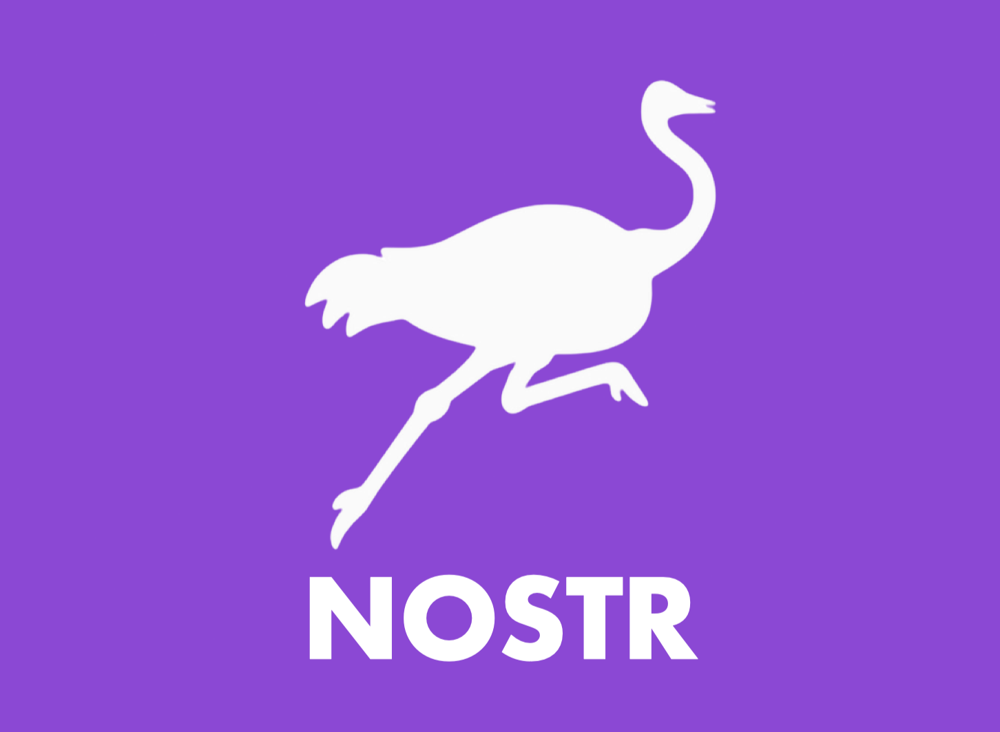

# 🦅 HandleHawk

**HandleHawk** is a cross-platform username reconnaissance tool for OSINT analysts, CyberSecurity professionnals, Red Teamers, and CTF enthusiasts. 
It scans multiple social platforms to gather publicly available user information by just a single username input.

> **"Find the signal in the noise."**

[](https://github.com/psf/black)

<p align="center">
  
</p>


# 📁 Repository Structure


```
HandleHawk/
│
├── API_KEY/
│   └── twitter_api_key.txt      # Optional Twitter API Key file
│
├── handlehawk.py                # Main script
├── requirements.txt             # Python dependencies
├── README.md                    # Tool documentation
├── platforms/                   # External platform modules added after tool creation
│   ├── __init__.py              # Makes platforms a package
│   └── paypal.py                # PayPal Module
├── Assets/                      # Assets folder
    └── HandleHawk_Logo.png      # HandleHawk logo
    └── HandleHawk_small.png     # HandleHawk logo (small)
    └── Report_Sample[1].html    # HandleHawk report sample
    └── Report_Sample[2].html    # HandleHawk report sample
    └── test1.png                # Testing platforms before launch
    └── test2.png                # Testing platforms before launch
    └── HandleHawk-cyberguy.pdf  # Clean PDF report from html
    └── Bluesky_Logo.png
    └── Mastodon_Logo.png
    └── Nostr_Logo.png
    └── Paypal_Logo.png
    └── Reddit_Logo.png
    └── Snapchat_Logo.png
    └── Truth-Social_Logo.png
    └── X_Logo.png

```

---

## ✔ Currently Supported Platforms

| Platform | Logo | Supported |
|----------|------|-----------|
| BlueSky     |     | ✅ |
| Mastodon    |   | ✅ |
| Nostr       |         | ✅ |
| PayPal      |       | ✅ |
| Reddit      |       | ✅ |
| Snapchat    |   | ✅ |
| TruthSocial |  | ✅ |
| X (Twitter) |         | ✅ + API |

---

## 🚀 Features

- 🔍 Scans multiple platforms:
  - Bluesky
  - Mastodon
  - Nostr
  - PayPal
  - Reddit
  - Snapchat
  - TruthSocial
  - Twitter (via optional RapidAPI)
- 🛡️ Resilient to Cloudflare thanks to cloudscraper
- 📄 Generates a clean, dark-mode HTML report
- 🧠 Smart spinner for each check (UX-friendly)
- 🔐 Optional Twitter API key (kept local)

---

### 🧠 Advanced Nostr Support

- ✅ Supports **pagination** through *all available pages* of Nostr search results (up to hundreds of results!)
- 🔁 Converts **hex-encoded pubkeys** to **Nostr npub format** using Bech32 encoding
- 🔗 Generates accurate profile links: `https://nostrapp.link/npub...`
- 📅 Displays account **creation date and time** in human-readable format

> This allows HandleHawk to return **all Nostr profiles** that match a username, with rich metadata and clickable profile URLs — not just the first few!


## 📦 Installation

```bash
git clone https://github.com/C3n7ral051nt4g3ncy/HandleHawk.git
cd HandleHawk
pip install -r requirements.txt
```

---

# 🔑 Twitter API Key (Optional)

**To enable Twitter checks (via RapidAPI), do the following:**

- Create a free account on [Rapid API](https://rapidapi.com/)
- Choose the [free Twitter API plan](https://rapidapi.com/alexanderxbx/api/twitter-api45) (1000 requests per month) by **Alexander Vikhorev**
- Paste your API key into the file `twitter_api_key.txt`
- **If no key is found, HandleHawk will skip X/Twitter and continue without errors**

---

# ⚙️ Usage
Run the tool from terminal:

```bash
python3 handlehawk.py
```


https://github.com/user-attachments/assets/5c44834b-52dc-46b7-8b52-fc1d25f659fc

---
## 🛣️ Roadmap

A list of upcoming features and improvements planned for **HandleHawk**:

### ✅ v1.0 (Completed)
- [x] Core recon engine with spinner animations  
- [x] Cross-platform username scanning for:
  - [x] Reddit  
  - [x] Mastodon  
  - [x] Bluesky  
  - [x] TruthSocial  
  - [x] Nostr
  - [x] Snapchat  
- [x] Twitter (X) scanning via optional RapidAPI key  
- [x] HTML report generator with profile summaries & images which does more than other username enumeration tools
- [x] Optional `API_KEY/` folder for key management  
- [x] User-agent spoofing & anti-bot headers

---

### ✅ v1.1 (Completed)
 
 - [x] PayPal module added (platforms/paypal.py)
 - [x] Extract PayPal full name, currency, and avatar
 - [x] Refactored architecture to support modular platform checks
 - [x] Improved HTML report with PayPal-specific display logic
 - [x] Clean integration of external paypal.py instead of monolithic block

---

### 🧠 Planned for v1.2
  
- [ ] CSV report export  
- [ ] JSON output for automation
- [ ] Support for more platforms:
  - [ ] Threads
  - [ ] Facebook
  - [ ] Telegram  
  - [ ] LinkedIn
  - [ ] YouTube
  - [ ] GitHub

---

# 👨‍💻 Author

Developed by [C3n7ral051nt4g3ncy](https://github.com/C3n7ral051nt4g3ncy)

---

# 💡 Suggestions?

- Open an issue or start a discussion! Contributions and feature ideas are welcome 🦅
- If you use HandleHawk in your investigations, feel free to give a ⭐️ or suggest a feature!


